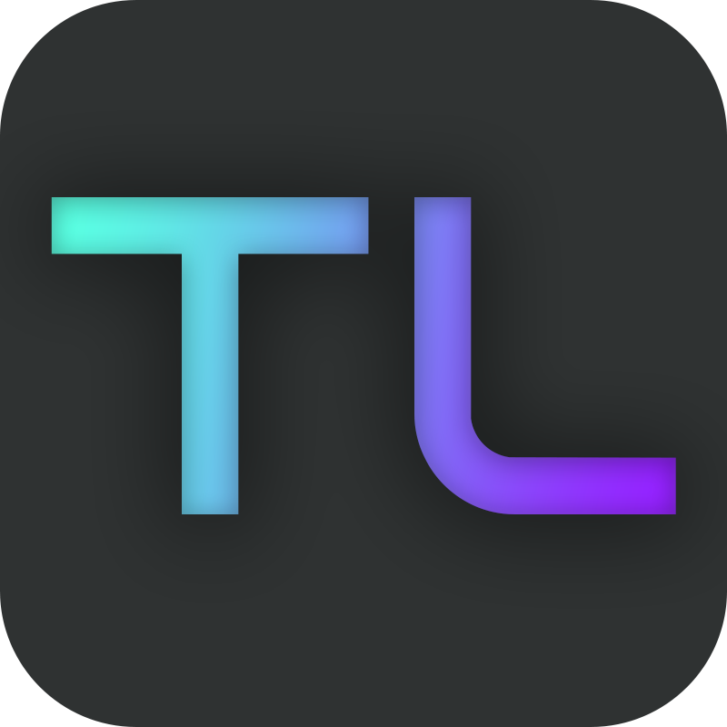

# TELLING  

</a>

**Telling** is an example of storytelling platforms, connecting people from various backgrounds. It is a website for people with ideas, knowledge, and opinions to write articles for everyone to read without needing to be friends or follow someone like today’s social network by using category cards and stories suggested on the homepage. It also has functions for writing and reading novels that are popular among teenagers. It will be a chat-style novel (click-to-read) of which the writing will be in the form of chat conversations between characters, and it will bounce up by clicking on the specified area. Readers just click on the chat screen to read what the characters are talking about. The fun and addictiveness depend on the author of the story.

## Project Documents
* [Vision Statement](../../wiki/Vision%20Statement)
* [Requirements](../../wiki/Requirements)
* [Code Review Script](../../wiki/Code%20Review%20Script)
* [Code Review Checklist](../../wiki/Code%20Review%20Checklist)
* [Iteration 1 Plan](../../wiki/Iteration-1-Plan) and [Task Board](../../projects/1)
* [Iteration 2 Plan](../../wiki/Iteration-2-Plan) and [Task Board](../../projects/2)
* [Iteration 3 Plan](../../wiki/Iteration-3-Plan) and [Task Board](../../projects/3)
* [Iteration 4 Plan](../../wiki/Iteration-4-Plan) and [Task Board](../../projects/4)
* [Iteration 5 Plan](../../wiki/Iteration-5-Plan) and [Task Board](../../projects/8)
* [Iteration 6 Plan](../../wiki/Iteration-6-Plan) and [Task Board](../../projects/10)

## Getting Started

For Linux or MacOS use **pip3 and python3**

### Step 1: Clone the project to your local directory

Open the Terminal and use command:

    git clone https://github.com/kidstylex/TELLING.git

### Step 2: Go to the project directory

    cd TELLING

### Step 3: Create new virtual enviroment

    virtualenv env

### Step 4: Activate virtualenv

***On MacOS and Linux:***

    source venv/bin/activate

or

    .  env/bin/activate

***On Windows:***

    venv\Scripts\activate

### Step 5: Install all required packages

    pip install -r requirements.txt

### Step 6: Finish env.example instruction

    cat env.example

### Step 7: Create database tables

    python manage.py migrate

### Step 8: Load data from data.json

    python manage.py loaddata data.json
    
### Step 9: Run server at localhost:8000

    python manage.py runserver 

## Team Members

GitHub                                     |           Name            |       
-------------------------------------------|---------------------------|
[kidstylex](https://github.com/kidstylex)  |  Arisa Pangpeng           |             
[mark47546](https://github.com/mark47546)  |  Natthaphon Rakprakobkij  |              
[KOngTNP](https://github.com/kongtnp)      |   Tanapol Buangam         |       
[theethaj](https://github.com/theethaj)    |  Tetach Rattanavikran     |              
